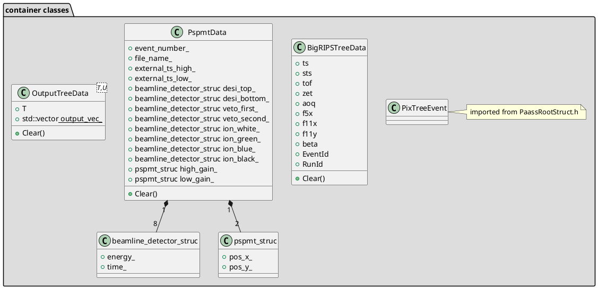

### uml: class diagram

```plantuml
@startuml
package "container classes" #DDDDDD {
    class BigRIPSTreeData {
        + ts
        + sts
        + tof
        + zet
        + aoq
        + f5x
        + f11x
        + f11y
        + beta
        + EventId
        + RunId
        + Clear()
    }

    class beamline_detector_struc {
        + energy_
        + time_
    }

    class pspmt_struc {
        + pos_x_
        + pos_y_
    }

    class PspmtData {
        + event_number_
        + file_name_
        + external_ts_high_
        + external_ts_low_
        + beamline_detector_struc desi_top_
        + beamline_detector_struc desi_bottom_
        + beamline_detector_struc veto_first_
        + beamline_detector_struc veto_second_
        + beamline_detector_struc ion_white_
        + beamline_detector_struc ion_green_
        + beamline_detector_struc ion_blue_
        + beamline_detector_struc ion_black_
        + pspmt_struc high_gain_
        + pspmt_struc low_gain_
        + Clear()
    }

    class PixTreeEvent {
    }
    note right of PixTreeEvent
        imported from PaassRootStruct.h
    end note
    
    class OutputTreeData<T,U> {
        + T
        + std::vector<U> output_vec_
        + Clear()
    }

    PspmtData "1" *-- "8" beamline_detector_struc
    PspmtData "1" *-- "2" pspmt_struc


}
@enduml
```