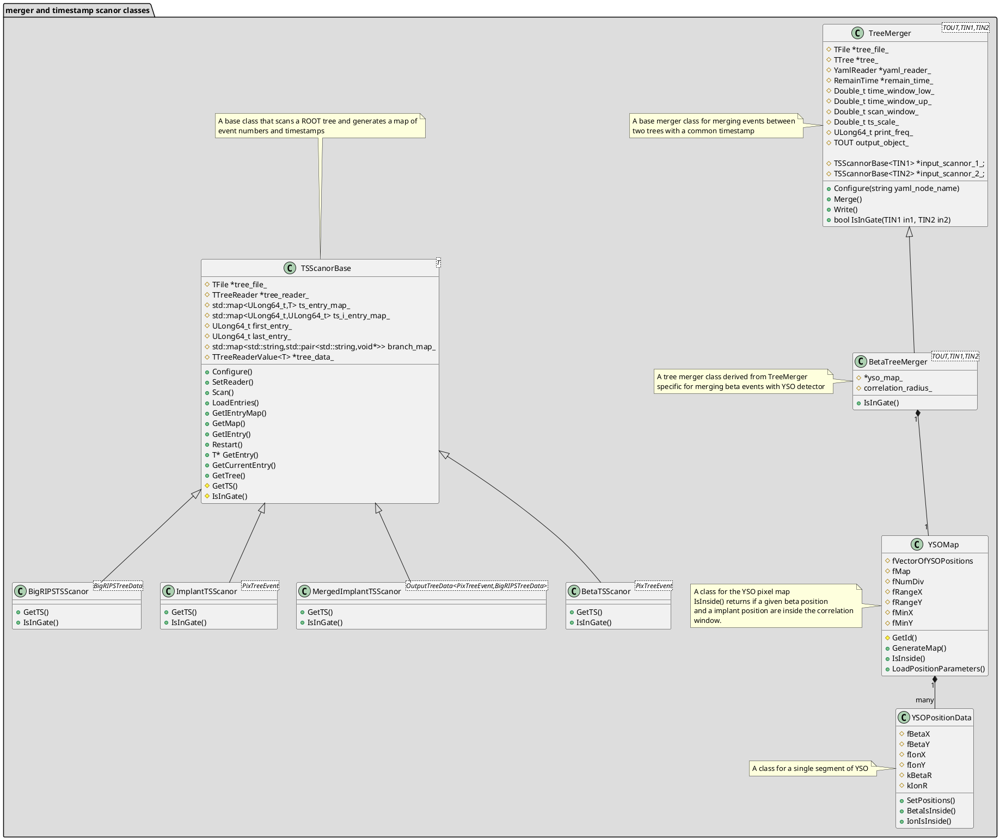

### uml: class diagram

```plantuml
@startuml
package "merger and timestamp scanor classes" #DDDDDD {
    class TSScanorBase <T> {
        # TFile *tree_file_
        # TTreeReader *tree_reader_
        # std::map<ULong64_t,T> ts_entry_map_
        # std::map<ULong64_t,ULong64_t> ts_i_entry_map_
        # ULong64_t first_entry_
        # ULong64_t last_entry_
        # std::map<std::string,std::pair<std::string,void*>> branch_map_
        # TTreeReaderValue<T> *tree_data_
        
        + Configure()
        + SetReader()
        + Scan()
        + LoadEntries()
        + GetIEntryMap()
        + GetMap()
        + GetIEntry()
        + Restart()
        + T* GetEntry()
        + GetCurrentEntry()
        + GetTree()
        # GetTS()
        # IsInGate()
    }
    note top of TSScanorBase
        A base class that scans a ROOT tree and generates a map of
        event numbers and timestamps
    end note

    class BigRIPSTSScanor <BigRIPSTreeData> {
        + GetTS()
        + IsInGate()
    }

    class ImplantTSScanor <PixTreeEvent> {
        + GetTS()
        + IsInGate()
    }

    class MergedImplantTSScanor <OutputTreeData<PixTreeEvent,BigRIPSTreeData>> {
        + GetTS()
        + IsInGate()
    }

    class BetaTSScanor <PixTreeEvent> {
        + GetTS()
        + IsInGate()
    }

    class TreeMerger<TOUT,TIN1,TIN2> {
        # TFile *tree_file_ 
        # TTree *tree_
        # YamlReader *yaml_reader_
        # RemainTime *remain_time_
        # Double_t time_window_low_
        # Double_t time_window_up_
        # Double_t scan_window_
        # Double_t ts_scale_
        # ULong64_t print_freq_
        # TOUT output_object_

        # TSScannorBase<TIN1> *input_scannor_1_; 
        # TSScannorBase<TIN2> *input_scannor_2_;

        + Configure(string yaml_node_name)
        + Merge()
        + Write()
        + bool IsInGate(TIN1 in1, TIN2 in2)
    }
    note left of TreeMerger
        A base merger class for merging events between
        two trees with a common timestamp
    end note

    class BetaTreeMerger<TOUT,TIN1,TIN2> {
        + IsInGate()
        # *yso_map_
        # correlation_radius_
    }
    note left of BetaTreeMerger
        A tree merger class derived from TreeMerger
        specific for merging beta events with YSO detector
    end note

    class YSOPositionData {
        # fBetaX
        # fBetaY
        # fIonX
        # fIonY
        # kBetaR
        # kIonR
        + SetPositions()
        + BetaIsInside()
        + IonIsInside()
    }
    note left of YSOPositionData
        A class for a single segment of YSO
    end note

    class YSOMap{
        # fVectorOfYSOPositions
        # fMap
        # fNumDiv
        # fRangeX
        # fRangeY
        # fMinX
        # fMinY
        # GetId()
        + GenerateMap()
        + IsInside()
        + LoadPositionParameters()
    }
    note left of YSOMap
        A class for the YSO pixel map
        IsInside() returns if a given beta position
        and a implant position are inside the correlation
        window.
    end note

    TSScanorBase <|-- ImplantTSScanor
    TSScanorBase <|-- BigRIPSTSScanor
    TSScanorBase <|-- MergedImplantTSScanor
    TSScanorBase <|-- BetaTSScanor
    TreeMerger <|-- BetaTreeMerger
    BetaTreeMerger "1" *-- "1" YSOMap
    YSOMap "1" *-- "many" YSOPositionData
}
@enduml
```