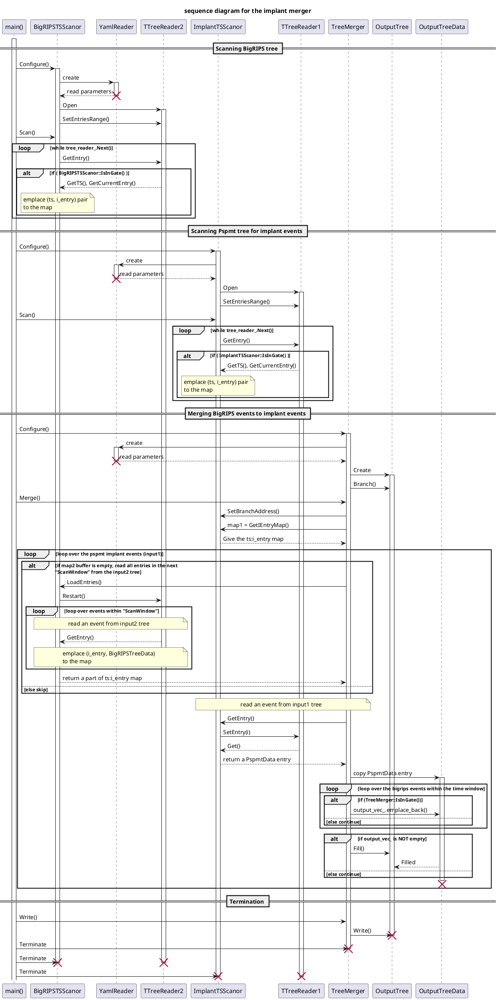

### uml: sequence diagram

```plantuml
@startuml
    title sequence diagram for the implant merger

    activate "main()"

    == Scanning BigRIPS tree ==
    "main()" -> "BigRIPSTSScanor" : Configure()
    activate "BigRIPSTSScanor"
    "BigRIPSTSScanor" -> "YamlReader" : create
    activate "YamlReader"
    "YamlReader" --> "BigRIPSTSScanor" : read parameters
    destroy "YamlReader"
    "BigRIPSTSScanor" -> "TTreeReader2" : Open
    activate "TTreeReader2"
    "BigRIPSTSScanor" -> "TTreeReader2" : SetEntriesRange()
    "main()" -> "BigRIPSTSScanor" : Scan()
    loop while tree_reader_.Next()
        "BigRIPSTSScanor" -> "TTreeReader2" : GetEntry()
        alt if ( BigRIPSTSScanor::IsInGate() )
            "TTreeReader2" --> "BigRIPSTSScanor" : GetTS(), GetCurrentEntry()
            note over BigRIPSTSScanor
                emplace (ts, i_entry) pair
                to the map
            end note
        end
    end

    == Scanning Pspmt tree for implant events ==
    "main()" -> "ImplantTSScanor" : Configure()
    activate "ImplantTSScanor"
    "ImplantTSScanor" -> "YamlReader" : create
    activate "YamlReader"
    "YamlReader" --> "ImplantTSScanor" : read parameters
    destroy "YamlReader"
    "ImplantTSScanor" -> "TTreeReader1" : Open
    activate "TTreeReader1"
    "ImplantTSScanor" -> "TTreeReader1" : SetEntriesRange()
    "main()" -> "ImplantTSScanor" : Scan()
    loop while tree_reader_.Next()
        "ImplantTSScanor" -> "TTreeReader1" : GetEntry()
        alt if ( ImplantTSScanor::IsInGate() )
            "TTreeReader1" --> "ImplantTSScanor" : GetTS(), GetCurrentEntry()
            note over ImplantTSScanor
                emplace (ts, i_entry) pair
                to the map
            end note
        end
    end

    == Merging BigRIPS events to implant events ==
    "main()" -> "TreeMerger" : Configure()
    activate "TreeMerger"
    "TreeMerger" -> "YamlReader" : create
    activate "YamlReader"
    "YamlReader" --> "TreeMerger" : read parameters
    destroy "YamlReader"
    "TreeMerger" -> "OutputTree" : Create
    activate "OutputTree"
    "TreeMerger" -> "OutputTree" : Branch()
    "main()" -> "TreeMerger" : Merge()
    "TreeMerger" -> "ImplantTSScanor" : SetBranchAddress()
    "TreeMerger" -> "ImplantTSScanor" : map1 = GetIEntryMap()
    "ImplantTSScanor" --> "TreeMerger" : Give the ts:i_entry map 
    loop loop over the pspmt implant events (input1)
        alt if map2 buffer is empty, read all entries in the next \n"ScanWindow" from the input2 tree
            "TreeMerger" -> "BigRIPSTSScanor" : LoadEntries()
            "BigRIPSTSScanor" -> "TTreeReader2" : Restart()
            loop loop over events within "ScanWindow"
                note over BigRIPSTSScanor, TTreeReader2
                    read an event from input2 tree
                end note
                "TTreeReader2" --> "BigRIPSTSScanor" : GetEntry()
                note over BigRIPSTSScanor, TTreeReader2
                    emplace (i_entry, BigRIPSTreeData)
                    to the map
                end note
            end
            "BigRIPSTSScanor" --> "TreeMerger" : return a part of ts:i_entry map
        else else skip
        end
        note over ImplantTSScanor, TreeMerger
            read an event from input1 tree
        end note
        "TreeMerger" -> "ImplantTSScanor" : GetEntry()
        "ImplantTSScanor" -> "TTreeReader1" : SetEntry(i)
        "TTreeReader1" --> "ImplantTSScanor" : Get()
        "ImplantTSScanor" --> "TreeMerger" : return a PspmtData entry
        "TreeMerger" -> "OutputTreeData" : copy PspmtData entry
        activate "OutputTreeData"
        loop loop over the bigrips events within the time window
            alt if (TreeMerger::IsInGate())
                "TreeMerger" -> "OutputTreeData" : output_vec_.emplace_back()
            else else continue
            end
        end
        alt if output_vec_ is NOT empty
            "TreeMerger" -> "OutputTree" : Fill()
            "OutputTreeData" --> "OutputTree" : Filled
        else else continue
        end
        destroy "OutputTreeData"
    end
    == Termination ==
    "main()" -> "TreeMerger" : Write()
    "TreeMerger" -> "OutputTree" : Write()
    destroy "OutputTree"
    "main()" -> "TreeMerger" : Terminate
    destroy "TreeMerger"
    "main()" -> "BigRIPSTSScanor" : Terminate
    destroy "BigRIPSTSScanor"
    destroy "TTreeReader2"
    "main()" -> "ImplantTSScanor" : Terminate
    destroy "ImplantTSScanor"
    destroy "TTreeReader1"
@enduml
```