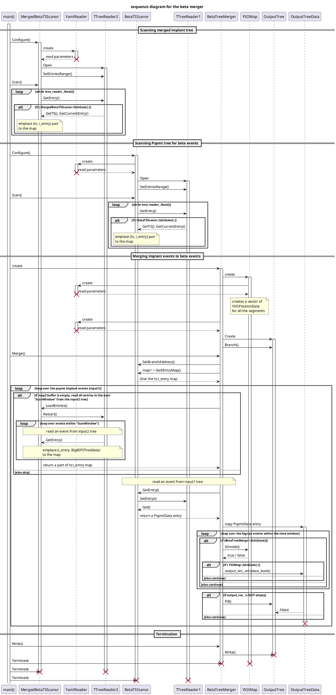

### uml: sequence diagram

```plantuml
@startuml
    title sequence diagram for the beta merger

    activate "main()"

    == Scanning merged implant tree ==
    "main()" -> "MergedBetaTSScanor" : Configure()
    activate "MergedBetaTSScanor"
    "MergedBetaTSScanor" -> "YamlReader" : create
    activate "YamlReader"
    "YamlReader" --> "MergedBetaTSScanor" : read parameters
    destroy "YamlReader"
    "MergedBetaTSScanor" -> "TTreeReader2" : Open
    activate "TTreeReader2"
    "MergedBetaTSScanor" -> "TTreeReader2" : SetEntriesRange()
    "main()" -> "MergedBetaTSScanor" : Scan()
    loop while tree_reader_.Next()
        "MergedBetaTSScanor" -> "TTreeReader2" : GetEntry()
        alt if ( MergedBetaTSScanor::IsInGate() )
            "TTreeReader2" --> "MergedBetaTSScanor" : GetTS(), GetCurrentEntry()
            note over MergedBetaTSScanor
                emplace (ts, i_entry) pair
                to the map
            end note
        end
    end

    == Scanning Pspmt tree for beta events ==
    "main()" -> "BetaTSScanor" : Configure()
    activate "BetaTSScanor"
    "BetaTSScanor" -> "YamlReader" : create
    activate "YamlReader"
    "YamlReader" --> "BetaTSScanor" : read parameters
    destroy "YamlReader"
    "BetaTSScanor" -> "TTreeReader1" : Open
    activate "TTreeReader1"
    "BetaTSScanor" -> "TTreeReader1" : SetEntriesRange()
    "main()" -> "BetaTSScanor" : Scan()
    loop while tree_reader_.Next()
        "BetaTSScanor" -> "TTreeReader1" : GetEntry()
        alt if ( BetaTSScanor::IsInGate() )
            "TTreeReader1" --> "BetaTSScanor" : GetTS(), GetCurrentEntry()
            note over BetaTSScanor
                emplace (ts, i_entry) pair
                to the map
            end note
        end
    end

    == Merging implant events to beta events ==
    "main()" -> "BetaTreeMerger" : create
    activate "BetaTreeMerger"
    "BetaTreeMerger" -> "YSOMap" : create
    activate "YSOMap"
    "YSOMap" -> "YamlReader" : create
    activate "YamlReader"
    "YamlReader" --> "YSOMap" : read parameters
    destroy "YamlReader"
    note over YSOMap
        creates a vector of
        YSOPositionData
        for all the segments
    end note
    "BetaTreeMerger" -> "YamlReader" : create
    activate "YamlReader"
    "YamlReader" --> "BetaTreeMerger" : read parameters
    destroy "YamlReader"
    "BetaTreeMerger" -> "OutputTree" : Create
    activate "OutputTree"
    "BetaTreeMerger" -> "OutputTree" : Branch()
    "main()" -> "BetaTreeMerger" : Merge()
    "BetaTreeMerger" -> "BetaTSScanor" : SetBranchAddress()
    "BetaTreeMerger" -> "BetaTSScanor" : map1 = GetIEntryMap()
    "BetaTSScanor" --> "BetaTreeMerger" : Give the ts:i_entry map 
    loop loop over the pspmt implant events (input1)
        alt if map2 buffer is empty, read all entries in the next \n"ScanWindow" from the input2 tree
            "BetaTreeMerger" -> "MergedBetaTSScanor" : LoadEntries()
            "MergedBetaTSScanor" -> "TTreeReader2" : Restart()
            loop loop over events within "ScanWindow"
                note over MergedBetaTSScanor, TTreeReader2
                    read an event from input2 tree
                end note
                "TTreeReader2" --> "MergedBetaTSScanor" : GetEntry()
                note over MergedBetaTSScanor, TTreeReader2
                    emplace (i_entry, BigRIPSTreeData)
                    to the map
                end note
            end
            "MergedBetaTSScanor" --> "BetaTreeMerger" : return a part of ts:i_entry map
        else else skip
        end
        note over BetaTSScanor, BetaTreeMerger
            read an event from input1 tree
        end note
        "BetaTreeMerger" -> "BetaTSScanor" : GetEntry()
        "BetaTSScanor" -> "TTreeReader1" : SetEntry(i)
        "TTreeReader1" --> "BetaTSScanor" : Get()
        "BetaTSScanor" --> "BetaTreeMerger" : return a PspmtData entry
        "BetaTreeMerger" -> "OutputTreeData" : copy PspmtData entry
        activate "OutputTreeData"
        loop loop over the bigrips events within the time window
            alt if (BetaTreeMerger::IsInGate())
                "BetaTreeMerger" -> "YSOMap" : IsInside()
                "YSOMap" --> "BetaTreeMerger" : true / false
                alt if ( YSOMap::IsInGate() )
                    "BetaTreeMerger" -> "OutputTreeData" : output_vec_.emplace_back()
                else else continue
                end
            else else continue
            end
        end
        alt if output_vec_ is NOT empty
            "BetaTreeMerger" -> "OutputTree" : Fill()
            "OutputTreeData" --> "OutputTree" : Filled
        else else continue
        end
        destroy "OutputTreeData"
    end
    == Termination ==
    "main()" -> "BetaTreeMerger" : Write()
    "BetaTreeMerger" -> "OutputTree" : Write()
    destroy "OutputTree"
    "main()" -> "BetaTreeMerger" : Terminate
    destroy "BetaTreeMerger"
    destroy "YSOMap"
    "main()" -> "MergedBetaTSScanor" : Terminate
    destroy "MergedBetaTSScanor"
    destroy "TTreeReader2"
    "main()" -> "BetaTSScanor" : Terminate
    destroy "BetaTSScanor"
    destroy "TTreeReader1"
@enduml
```